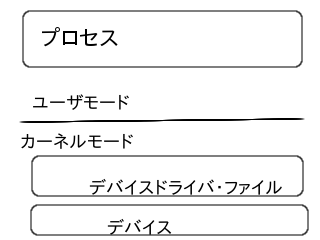

# システムコールについて

## 2019-02-09 田村 晃聖

---
# はじめに

## 私は,システムコールについて話します.

- システムコールって何？
- システムコールとは,|

---

## なぜシステムコールについて調べようと思ったのか.


- 四号機 の制御方法を調べてわからなかったためです.|

---

### 五号機

    ├── fifth_robot_pkgs
    │   ├── fifth_robot_2dnav # amcl move_base
    │   ├── fifth_robot_description #cartographer simulator
    │   ├── fifth_robot_launcher #sensor_bringup launchfile
    │   ├── fifth_robot_map #map
    │   └── fifth_robot_pkgs #nothing
    ├── goal_sender #targetpose from csv
    ├── goal_sender_msgs #msg generate for goal_sender
    ├── ros_imu_filter #imu config
    ├── teleop_master #radio control
    ├── third_party #laser-driver ypspur
    └── waypoints_reader #csv

---

### 五号機

`imu`
`3DLider`
`ypspur`

---

### 四号機

    ├── fourth_robot_2dnav #map amcl move_base param
    ├── fourth_robot_2dnav_gazebo #sim amcl move_base param
    ├── fourth_robot_bringup #joy sensor bringup waypoints-csv
    ├── fourth_robot_control #ragio control
    ├── fourth_robot_description #sim urdf xacro
    ├── fourth_robot_driver #motor controller control
    ├── fourth_robot_gazebo #world for sim
    ├── fourth_robot_slam #for imu
    ├── README.md
    └── scripts
    
---

### 四号機

`imu`
`2DLider`
`iMCs01`

---

## `fifth_robot` `fourth_robot` の違い

|`fifth_robot`|`fourth_robot`|
---|---
|`imu`|`imu`|
|`3DLider`|`2DLider`|
|`ypspur`|`iMCS01`|

---

### `motor-driver` を自分で管理する必要がありました.

四号機のモータドライバの設定ファイルを調べることにしました.

---

### 四号機

'fourth_robot_driver L155~L165'


```
  // uin構造体cmd_ccmdの設定を書き込むためのioctl
  // (設定を変えるたびに呼び出す必要あり)

  if(ioctl(fd, URBTC_COUNTER_SET) < 0)
    throw logic_error("Faild to ioctl: URBTC_COUNTER_SET");

  //uin構造体cmd_ccmdの設定を書き込む

  if(write(fd, &cmd_ccmd, sizeof(cmd_ccmd)) < 0){
    ...
    throw logic_error("Faild to write");
  }
```

---

四号機では`imcs01`を使ってドライバの制御を行っていたため,`imcs01`に書き込むために`ioctl()`を使います.

### `ioctl()`って何？

- システムコール関数の一つです.

---

### システムイメージ



---

### システムコール

- プロセス生成, 削除
- メモリ確保, 開放
- プロセス間通信
- ネットワーク
- ファイルシステム操作
- ファイル操作(デバイス操作)

があります.

この中で私は,ファイルシステム操作, ファイル操作について話します.

---

ファイルシステムのシステムコールのインターフェース

- ファイルの作成,削除: create(), unlink()
- ファイルを開く,閉じる: open(), close()
- 開いたファイルからデータを読み出す: read()
- 開いたファイルにデータを書き込む: write()
- 開いたファイルの所定のⅠに移動: lseek()
- 上記以外のファイルシステム依存の特殊な処理: ioctl()

---

## `open()`システムコール

open()システムコールはファイルディスクリプタを返すシステムコール関数です.

エラーが発生した場合には-1が返ります.

```
#include <sys/types.h>

#include <sys/stat.h>

#include <fcntl.h>

int open(const char *name, int flags);

int open(const char *name, int flags, mode_t mode);
```

---

## `open()`システムコール

flagsにはO_RDONLY, O_WRONLY, O_RDWRを指定します.

またビットOR演算子で動作を制御することができます.

---

## `open()`システムコール

O_APPEND
- ファイルを追加書きモード
O_ASYNC
- ファイルが端末またはソケット時にシグナルを発生させます.
O_CREAT
- 指定されたファイルがないときに,新たに作成します.
O_DIRECT
- ダイレクトI/O用にファイルを開く.

---

## `open()`システムコール

O_DIRECTORY
- nameがディレクトリでない場合はエラーを返します.
O_EXCL
- nameの名前が存在していた場合エラーを返します.
O_LARGEFILE
- サイズが2G以上のファイルを開くときに指定します.64ビットアーキテクチャの場合デフォルトで設定されます.
O_NOCTTY
- nameが端末を指す場合に,プロセスの制御端末にしません.

---

## `open()`システムコール

O_NOFOLLOW
- nameがシンボリックリンクのときにエラーを返します.
O_NONBLOCK
- ファイルをノンブロックモードで開きます.
O_SYNC
- 同期I/O用にファイルを開きます.
O_TRUNC
- ファイルがすでに存在し,かつ書き込み用のフラグを与えられているとき,ファイルをトランケートします.

---

## `open()`システムコール

modeはパーミッションを指定できます

こちらもビットOR演算子で渡すことができます.

---

## `open()`システムコール

S_IRWXU

- rwx --- ---

S_IRUSR

- r-- --- ---

S_IWUSR

- -w- --- ---

S_IXUSR

- --x --- ---

---

## `open()`システムコール

S_IRWXG

- --- rwx ---

S_IRGRP

- --- r-- ---

S_IWGRP

- --- -w- ---

S_IXGRP

- --- --x ---

---

## `open()`システムコール

S_IRWXO
 
- --- --- rwx

S_IROTH

- --- --- r--

S_IWOTH

- --- --- -w-

S_IXOTH

- --- --- --x

---

## `creat()`システムコール

creat()システムコールはopen()システムコールの特殊かと言っても良いでしょう.

`
int creat(const char* name, mode_t mode);
`

これは次のコードと同義です.
```
int creat(const char* name, mode_t mode)
{
  return open(name, O_WRONLY | O_CREAT | O_TRUNC, mode);
}
```

---

## `read()`システムコール

```
#include < unistd.h >

ssize_t read(int fd, void *buf, size_t len);
```

ここで引数のlenはバイト数を与えます.

受け取ったバイト数を返します.エラーが発生した場合は-1が返ります.

---

ioctl関数の宣言部

`#include < sys/ioctl.h >`

にて次のように宣言されています.

`extern int ioctl (int __fd, unsigned long int __request, ...) __THROW;`

---

ファイルディスクリプタを取り,ファイルへアクセスします.

---

ファイルディスクリプタを持つためには`open()`関数を使って,ファイルディスクリプタを受け取る必要があります.

---

### 参考資料

[［試して理解］Linuxのしくみ～実験と図解で学ぶOSとハードウェアの基礎知識](http://gihyo.jp/book/2018/978-4-7741-9607-7)実験プログラム

[Linuxシステムプログラミング](https://www.oreilly.co.jp/books/9784873113623/)

---
